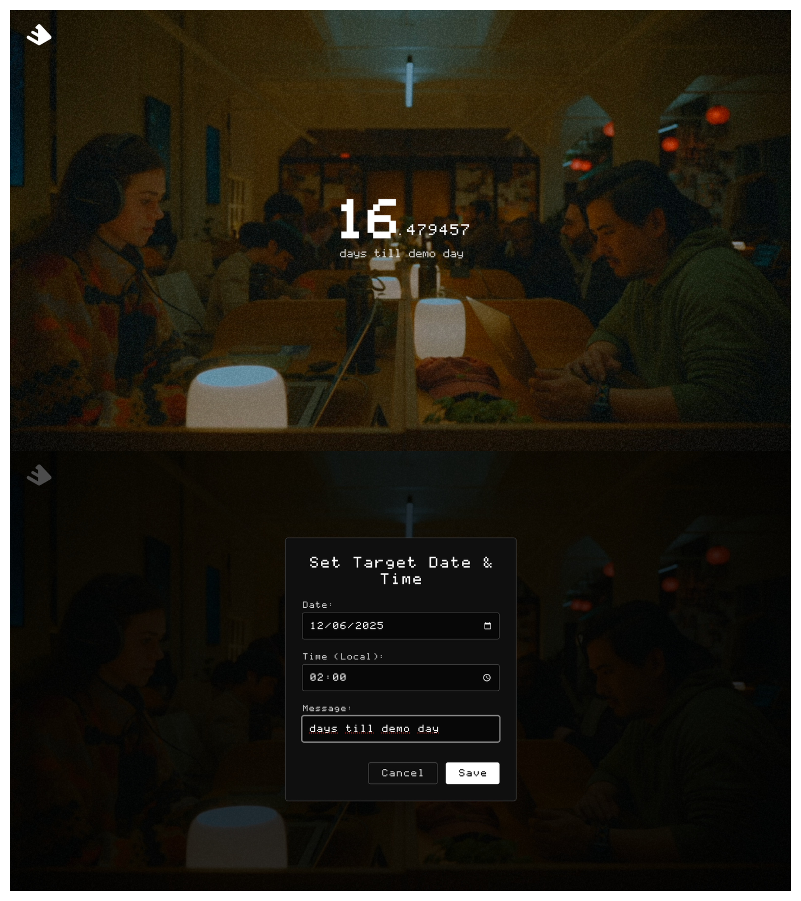

# 🧭 buildspace-os-countdown

Clone of the countdown page used during Buildspace Season 5.

🔗 Online demo:
- [http://51.159.52.193:8686/](http://51.159.52.193:8686/)
- [https://buildspace-os-countdown.cserv.space/](https://buildspace-os-countdown.cserv.space/)

<p align="center">
  <a href="https://raw.githubusercontent.com/Spixz/buildspace-os-countdown/refs/heads/main/screenshots/screenshots.png" target="_blank">
    
  </a>
</p>

## 🧩 Installation (Chrome Extension)

1. Open `chrome://extensions/` in Google Chrome.
2. Enable **Developer mode** (top right).
3. Click **"Load unpacked"** (top left).
4. Select the `buildspace-os-extension` folder.

## 🕹️ Usage

- Click the countdown to set a **target date** and a **custom message**.

## 🧪 Development build

```bash
npm install
npm run dev
npx http-server dist