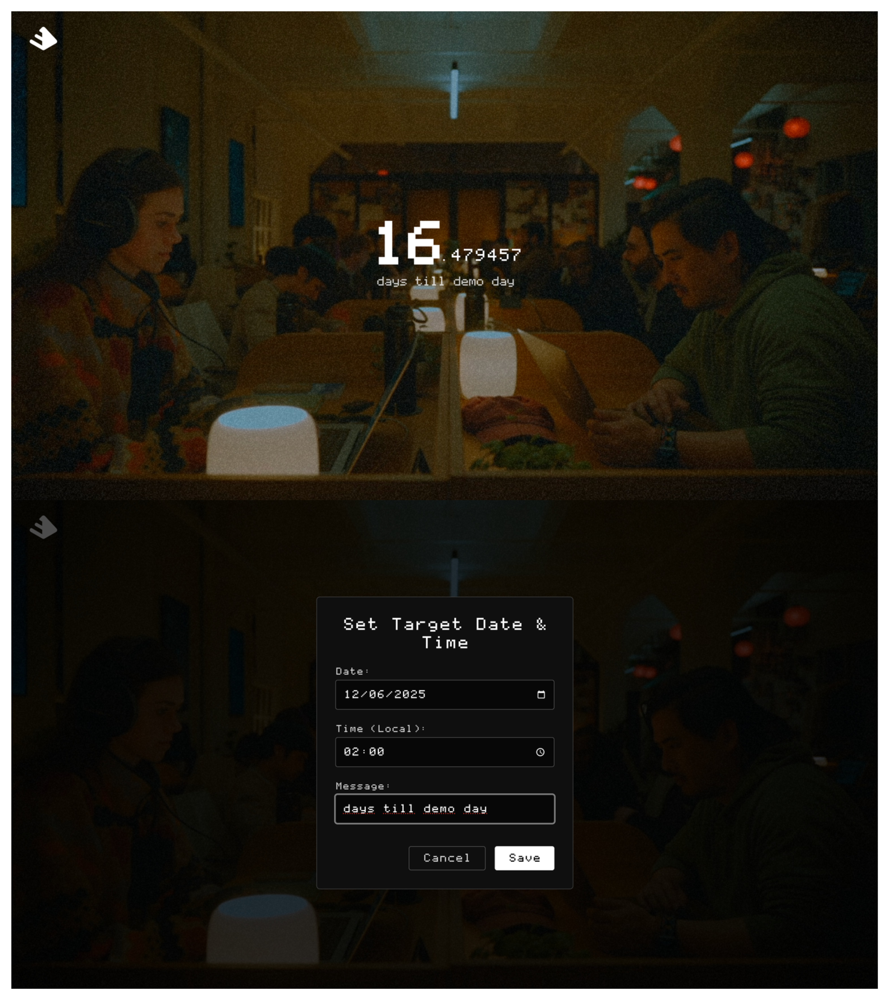

# 🧭 buildspace-os-countdown

Clone of the countdown page used during Buildspace Season 5.

🔗 [Online demo](https://buildspace-os-countdown.cserv.space)

<p align="center">
  <a href="https://raw.githubusercontent.com/Spixz/buildspace-os-countdown/refs/heads/main/screenshots/screenshots.png" target="_blank">
    
  </a>
</p>

## 🧩 Installation (Chrome Extension)

1. Open `chrome://extensions/` in Google Chrome.
2. Enable **Developer mode** (top right).
3. Click **"Load unpacked"** (top left).
4. Select the `buildspace-os-extension` folder.

## 🕹️ Usage

- Click the countdown to set a **target date** and a **custom message**.

## 🧪 Development build

```bash
npm install
npm run dev
```

## 📦 Production build

```bash
npm install
npm run build
```

The static site is generated in `dist/`.

## 🚀 PM2 + Caddy

Use the PM2 config in `ecosystem.config.cjs` to install dependencies, build the site, and serve `dist/` with Caddy on port `8686`.

```bash
pm2 start ecosystem.config.cjs --env production
```
